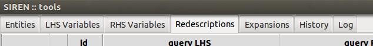
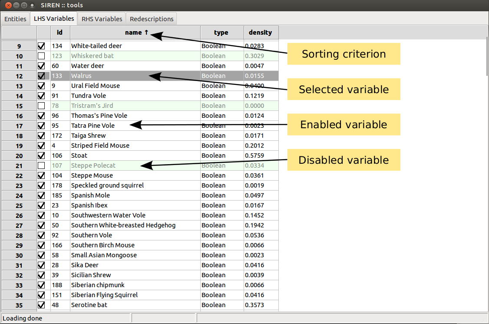
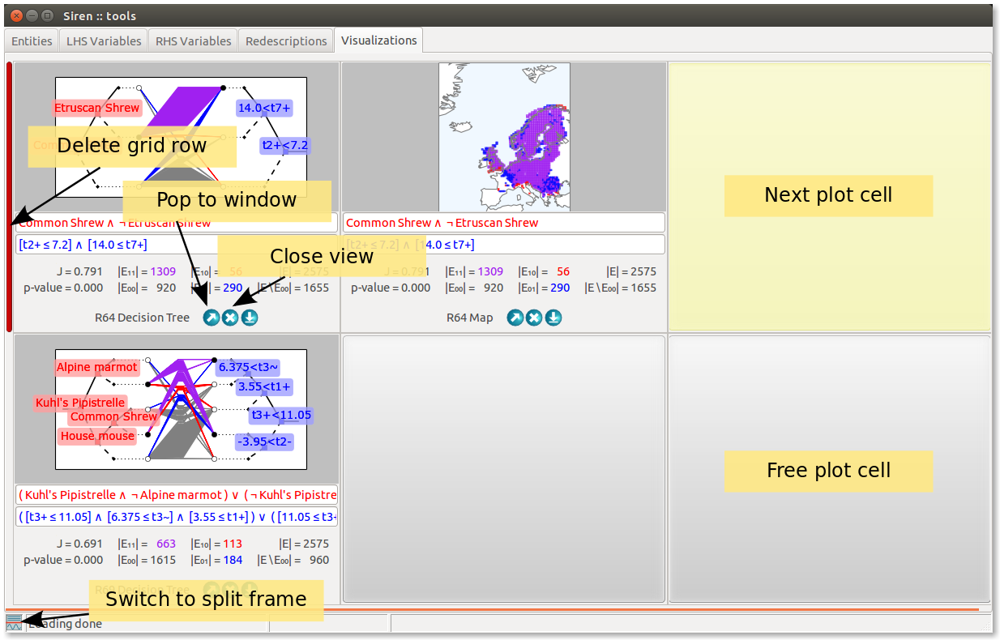
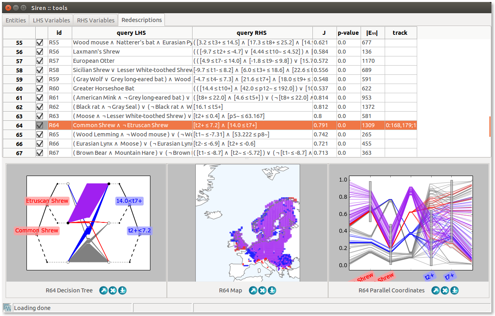
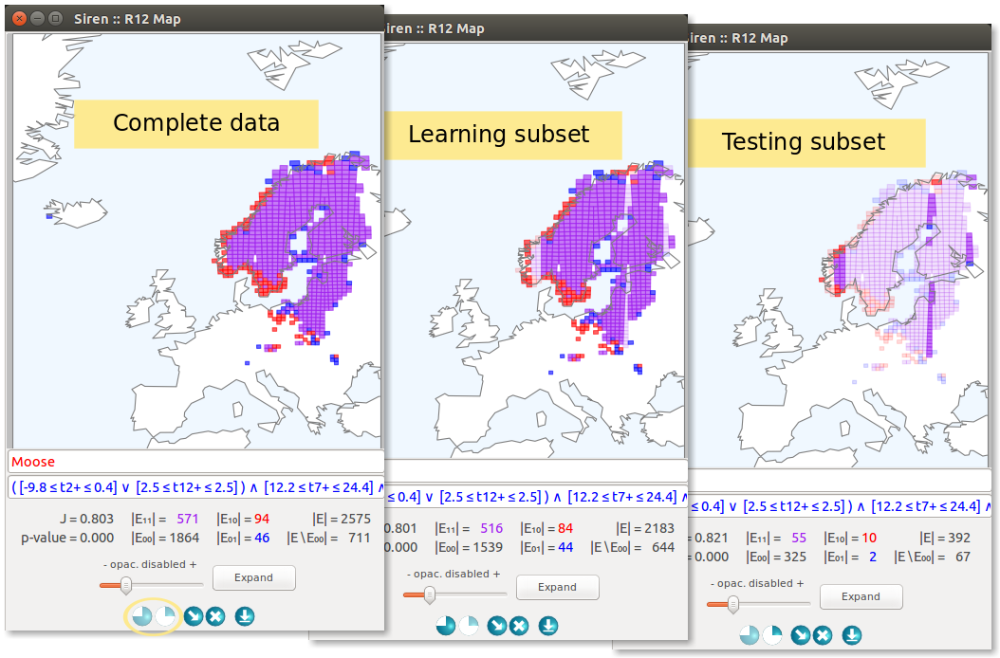

.. _interface:

****************
Interface
****************

.. _windows:

Windows and Tabs
=======================

.. note::
   *Siren* has two types of windows: :ref:`tools <tools_window>` and :ref:`view <view_window>`, which are presented below.

.. _tools_window:

Tools window
-------------

The ``Tools`` window is unique, it is the main siren window. It contains several tabs.

* The **Entities** tab contains the list of entities.

Two tabs contain lists of variables. 

* The **LHS Variables** tab,
* and the **RHS Variables** tab contain the list of left-hand side variables and right-hand side variables respectively.

Three tabs contain lists of redescriptions. 

* The **Redescriptions** tab is the main list of redescriptions. Redescriptions are imported and exported to and from that list.
* The **Expansions** tab lists redescriptions that have been generated by mining or extending queries.
* The **History** tab lists all edits made to queries, allowing to undo changes.

Finally, 

* the **Log** tab contains logging output generated by the mining algorithm.

Tabs can be shown or hidden via the interface menu :menuselection:`Windows --> Tabs`.

The main means to manipulate variables or redescriptions, depending on which tab you are currently viewing, are available via the ``Edit`` menu and the contextual menu opened by right click. 

List items can be enabled/disabled by checking/unchecking the corresponding box in the left column. All items in a list can be enabled/disabled simultaneously.
Lists can be sorted based on the value of the different fields displayed by clicking on the column header.

Redescriptions can be cut, copied, and pasted from and to different positions in the lists and from one list to the other and vice-versa.
All disabled redescriptions can be deleted at once.

.. _view_window: 

View window
--------------

A **view** window allows to visualize a redescription, to edit it and launch mining and expansion.
Several views of different types of the same redescription can be opened simultaneously. They are linked together an to the original redescription in the list so that edits and selections made in one view are reflected in the list and other views.

A ``View`` window can be opened with a double click on a variable or redescription in a list from the ``Tools`` window.

Both queries can be edited using the text boxes. If the :ref:`syntax of a query <queries>` is incorrect, *Siren* will not be able to parse it and it will fall back on the previous correct query.
Queries are parsed when ``ENTER`` is pressed, in order to avoid parsing error due to partial edits. 

:ref:`Redescriptions statistics <statistics>` are shown below the queries. 

Expansion can be started by pressing the ``Expand`` button. The expansion will be delegated to a background process. It can be interrupted via the menu :menuselection:`Process --> Stop expander XXX`, where running task are listed. Redescriptions generated during the expansion will be appended to the list of redescriptions in the ``Expansions`` tab.

Clicking on the entities, represented as lines or dots, highlights them accross the different views for the redescription with labels showing the entities's ID to allow identifying them.
It is also possible to enable highlighting and labeling the entities on hover (by activating `Hover entities` in the `Interface` preferences), and jumping to the entity in the entities list on click (by toggling :menuselection:`Edit --> View details`).

Some actions are visualization-specific. 
A slider allows to set the opacity of disabled entities in all visualizations except the tree diagrams. 
For parallel coordinates plots, another slider allows to adjust the level of details by limiting the fraction of entities drawn.

In case of projections, setting controls allow to set parameters and the data can be projected anew by clicking the ``Reproject`` button.
A polygon drawing tool allows to select groups of contiguous areas. 

In tree diagrams, clicking on a leaf allows to add and remove the corresponding branch to the query.
Then, ``Simplify LHS`` and ``Simplify RHS`` buttons allow to simplify the diagrams of the tree associated to the left-hand side and right-hand side queries, respectively. 

In parallel coordinates plots, the range of literals can be adjusted interactively by dragging the corresponding grey boxes.

.. _display_modes:

Display modes
--------------

Plotting the visualizations to separate windows is one possibility. In such a case, all controls and stats are available, as shown above.

An alternative is to plot the visualization to a grid inside a dedicated tab of the main window. In that case, to accomodate more visualizations, controls are not shown, but the queries and stats are still visible.

An entry of the ``Edit`` menu allows to choose whether visualizations should be plotted by default into new separate windows or inside the visualization tab.

The plots can be popped out of the tab into separate windows, and vice-versa using the arrow buttons. The cross allows to close the view. Rows and columns can be added and dropped from the visualization grid by clicking on the green bars to the bottom and to the right of the grid, and the red bars to the top and to the left of the grid respectively. On deletion of a row or column of the grid, all views it contains are closed.
The grid cell where the next visualization will be plotted is highlighted, a free cell can be chosen by simply clicking on it. If no free cell is available, the next plot will replace the oldest views in the grid, effectively deleting it.

Finally, clicking on the colored button on the bottom-left corner of the main window allows to split the main window horizontally into two frames, so as to show the grid of visualization beneath a list, for instance the list of redescriptions. To save further space the stats and queries are not shown in that case.
Clicking anew on the colored button restores the main window to a single frame.
 

.. _menu:

Menus
======

.. note::
   The main menu of *Siren* is at the top of the :ref:`Tools window <tools_window>`.

   Here is a summary of functionalities available throught the menu.

.. _file_menu:

File
---------

The ``File`` submenu provides import, export, opening and saving functionalities and setting the preferences.

.. _edit_menu:

Edit
-------

The content of the ``Edit`` submenu depends on the tab or view currently active.

If the tab contains redescriptions, it will also allow to filter the redescription and to copy, cut and paste them.

.. _view_menu:

Views
--------

If the tab contains redescriptions or variables the ``View`` menu will allow to open a :ref:`view window <view_window>` to visualize the selected item. Possible visualizations for an item might differ. For instance, if a redescription cannot be represented as a tree, the tree diagram entry of the menu will be disabled, the ``normalize`` function should be applied first.

.. _process_menu:

Process
---------

The ``Process`` menu allows to start mining redescriptions and contains a list of running task and allows to interrupt any of them.

.. _windows_menu:

Windows
----------

The ``Windows`` menu contains a list of tabs and allows to show or hide any of them.
It also contains a list of Views currently opened sorted by redescription, allowing to access any of them and close all at once.

.. _help_menu:

Help
------

The ``Help`` menu provides access to this help and to more information about *Siren* and licensing.

Contextual menu
----------------

Many ``Edit`` and ``Views`` functionalities can also be accessed via the contextual menu upon right-click on a redescription.

.. image:: ../_figs/screenshots/MenuContextRed.png

More
===============

.. note::
   *Siren* provide means to send computations to an external server, thereby helping to maintain the responsiveness of the interface

   In addition, to help study how well the redescriptions mined using a particular set of parameters generalize to unseen entities, *Siren* allows to easily partition the data, run the algorithm on a selected subset of the data and compare accuracy and support of the results.

Mining server
--------------

To pass mining and projection computation on to an external server, the settings for communicating with that server can be set in the ``Worker setup...`` in the ``File`` menu. This allows to set the IP address (set to local to disable the client-server mode), port and authentication key, and to test the connection and check whether some processes are already being run on the server.

Of course, the mining server should be setup with the relevant settings using the provided ``server_siren.py`` script.

Running the following, for instance, initializes a server on the feedback-loop listening on port 55444 with authentication key ``atk`` and having 4 workers (i.e. handling at most 4 different delegated tasks simultaneously). 

.. code:: bash 

	  python server_siren.py 127.0.0.1 --portnum=55444 --authkey=atk --max_k=4

k-fold mining
--------------

Finally, *Siren* also allows to partition the data to study how redescription characteristics vary on different data subsets.

The settings for doing this can be accessed through the ``Splits setup...`` in the ``File`` menu.

The upper half of the dialogue box allows to choose parameters to generate a data partition automatically, by selecting a column or coordinate to whose values will direct the partition. A value greater than zero identifies a data column by its position, while a value lower than zero indentifies a coordinate, a value of zero means that the data will be partitioned randomly. That is, 1 corresponds to the first column on the left-hand side, while 12 corresponds to second column on the right-hand side assuming the left-hand side contains 10 columns, and -1 corresponds to the first coordinates dimension, i.e. the longitudes. 
The granularity allows to tune the width of the bands, while the number of folds defines the number of partitions returned.

The lower half of the dialogue box allows to choose the source, either desactivating the splits, using the automatic settings described above to generate partitions or extracting it from a data column (a categorical variable, where each category will generate a partition).
Once this is set, the partitions can be generated. Next, the resulting partitions can be assigned to the learn (L) or test (T) folds.
A partition can be stored in the data by encoding it as an additional column, so that it can be loaded again later on.

After the splits setup as been applied, new columns will appear in the redescription lists, showing the statistics (accuracy, p-Values, support) on the learn and test folds.

In views, a pair of buttons will appear allowing to focus on the complete data or on either split.

