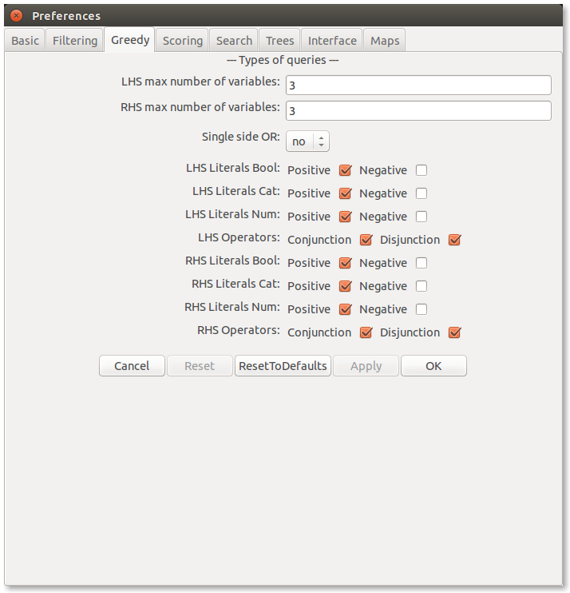
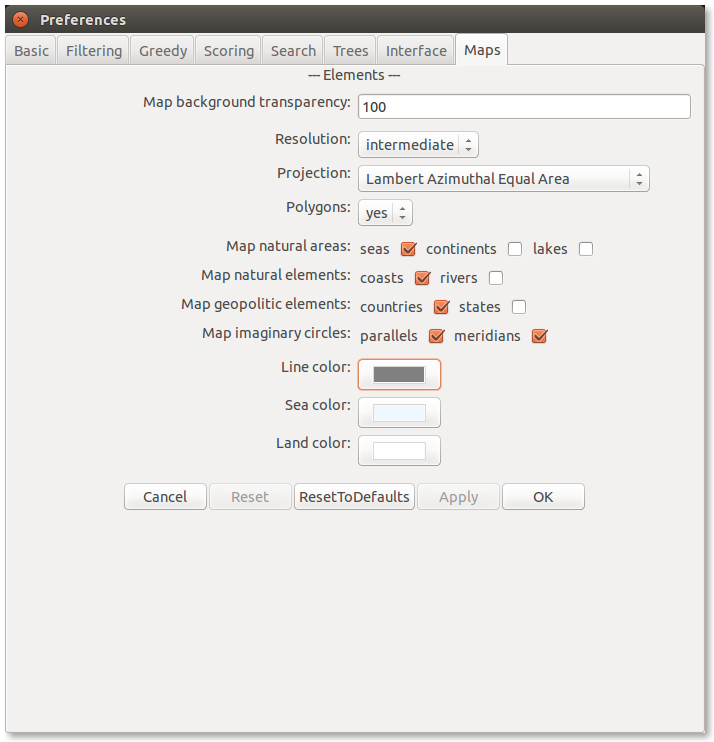
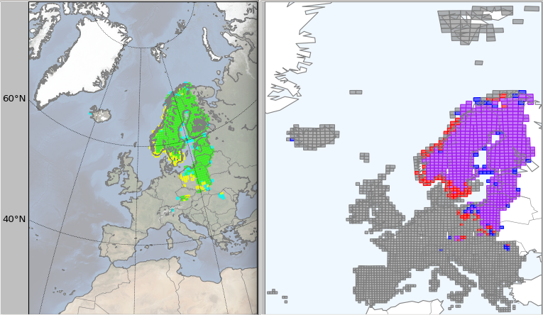

.. _preferences:

**************
Preferences
**************

.. note::
   Preference parameters can be set via the interface menu :menuselection:`Edit --> Preferences`.

   An XML preferences file stores all non-default parameters. 

.. _mining_parameters:

Mining parameters
=========================

Mining parameters are specified `here <../_static/miner_confdef.xml>`_ and can be set through the interface.

.. _interface_parameters:

Interface parameters
=========================

Interface parameters are specified `here <../_static/ui_confdef.xml>`_  and can be set through the interface.

For instance, this allows to modify the appearance of the maps.

.. _preferences_file:

Preferences file
=================

The ouline of a preferences file for *Siren* and *ReReMi* is as follows:

.. literalinclude:: ../_static/xml_prefs_example_comm.txt
