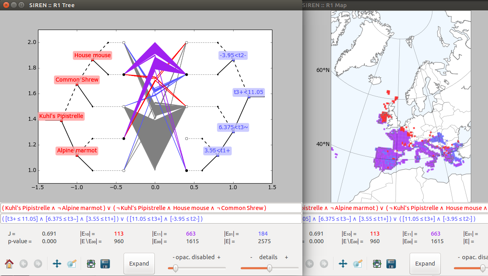

.. _usecase:

******************
Sample Use-Cases
******************

.. _uc_finnelec:

Finnish 2011 parliamentary elections
=========================================

We provide a :data_url:`prepared dataset <vaalikone/vaalikone.siren>` about the Finnish 2011 parliamentary elections. Get the data (non-geospatial), try out *Siren* and learn about the finnish political scene! (More details on the :project_url:`main webpage <main/>`.)

To illustrate the use of *Siren*, we present example use-cases from different application domains. 

.. _uc_bio:

Biological niche-finding
=========================

One use-case concerns niche-finding, i.e. the problem of finding species' bioclimatic envelope, an important task in biology.

