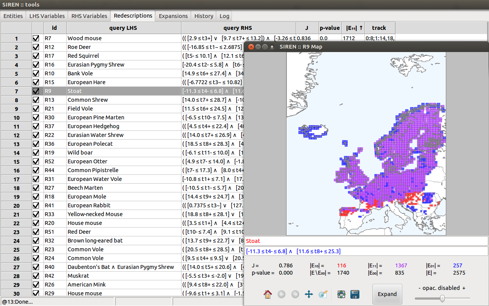
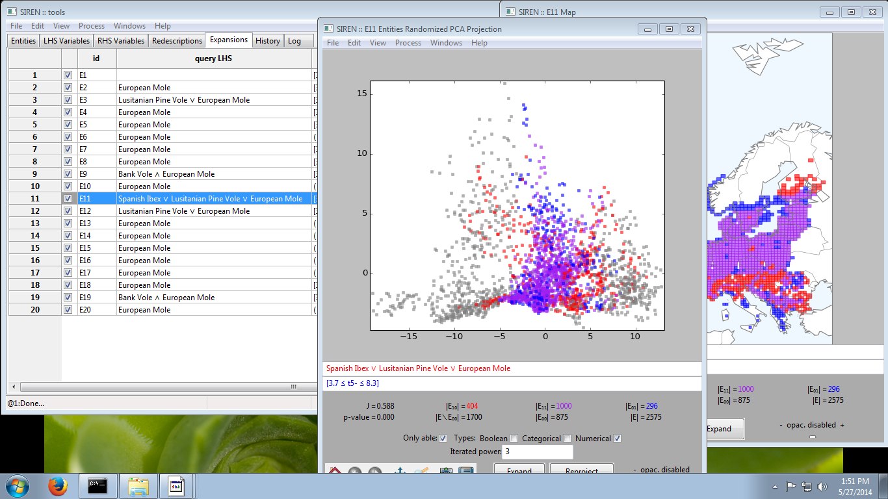

.. _download:

***************
Download
***************

.. note::
   *Siren* is a multi-platform software. It has been used on OS X and Ubuntu Linux.

   Siren and ReReMi are licensed under the Apache License, Version 2.0.

*Siren* and it's core mining algorithm *ReReMi* are implemented in Python.

The interface is built with the wxPython Open Source GUI toolkit, ensuring cross-platform compatibility.

The matplotlib library enables to generate high quality figures, seamlessly integrated in the interface.

.. _changelog:

CHANGELOG
==========

.. literalinclude:: ../_static/CHANGELOG

The latest release for each platform are listed here. Previous versions can be found in `this folder <http://www.cs.helsinki.fi/u/galbrun/redescriptors/code/siren/>`_.

Feel free to contact us for support or with feedback, bug reports and questions.

.. _code:

Source code
============

`python-siren-2.1.1.tar.gz <http://www.cs.helsinki.fi/u/galbrun/redescriptors/code/siren/python-siren-2.1.1.tar.gz>`_

The source code has been packaged using `Python distutils <http://docs.python.org/install/index.html>`_. 
To `install <http://docs.python.org/install/index.html#the-new-standard-distutils>`_, unpack the downloaded archive and run ``python setup.py install`` from within the created folder. 

*Siren* requires a number of python libraries: ``scipy``, ``numpy``, ``matplotlib``, ``wxPython``, ``mpl_toolkit.Basemap`` and ``sklearn`` (scikit-learn). Make sure they are installed and accessible before you run *Siren*.

You can find help under *Siren*'s Help menu or `online <http://www.cs.helsinki.fi/u/galbrun/redescriptors/siren/help/>`_.

.. _mac:

For OS X
============== 

`Siren.dmg (v2.0.2) <http://www.cs.helsinki.fi/u/pamietti/data/siren/Siren_2_0_2.dmg>`_

To *install*, download the above disk image and copy the file Siren to your Applications folder (or anywhere else outside the disk image). Once that is done you only have to double-click the program icon to run *Siren*.

To *run* the program, double-click the program icon.

You can find help under *Siren*'s Help menu or `online <http://www.cs.helsinki.fi/u/galbrun/redescriptors/siren/help/>`_.

.. warning::
   **Note for users of OS X with Gatekeeper activated (10.7.5 and newer)**

   The Siren application is not digitally signed. Therefore, users with OS X Gatekeeper active cannot run the Siren application by double-clicking it. An attempt to do so will result in an error message. In order to open Siren for the first time, you need to right-click (command-click) the Siren icon, and select "Open" from the contextual menu. You only need to do this for the first launch after every re-installation of Siren.

   More information about Gatekeeper can be found at `<http://support.apple.com/kb/HT5290">`_.
 
.. _linux:

For Linux
========== 

`python-siren_2.1.1_all.deb <http://www.cs.helsinki.fi/u/galbrun/redescriptors/code/siren/python-siren_2.1.1_all.deb>`_

With a debian-based distribution run the following commands as root to install

.. code:: bash 

	  dpkg -i the_latest_siren_deb_package.deb

Afterward, you might need to run, to fix dependencies, i.e., install missing required packages

.. code:: bash 

	  apt-get -f install

Or use a tool like Ubuntu Software Center to open the package and install the application.

If everything went fine, you should find a Siren entry in your Applications menu.

You can find help under *Siren*'s Help menu or `online <http://www.cs.helsinki.fi/u/galbrun/redescriptors/siren/help/>`_.

.. _windows:

For Windows
============

`install_siren_2.1.1.exe <http://www.cs.helsinki.fi/u/galbrun/redescriptors/code/siren/install_siren_2.1.1.exe>`_ 

Download and run to install *Siren*.

