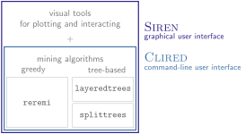
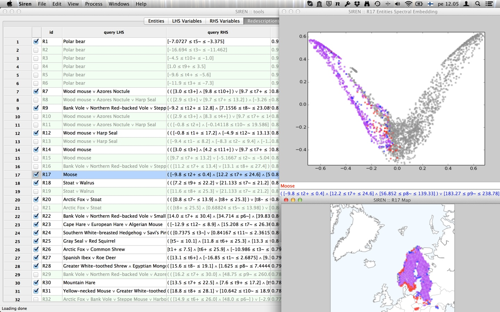

.. _download:

***************
Download
***************

.. note::
   *Siren* is a multi-platform software licensed under the Apache License, Version 2.0.

   *Siren* and the algorithms that come with it are implemented in Python.

*Siren* is the graphical user interface that allows to mine, visualize and interactively edit redescriptions.
*Clired* is the command-line user interface that allows to mine and preprocess redescriptions.
They rely on a few different :ref:`mining algorithms <algorithms>`.
   

The interface is built with the wxPython Open Source GUI toolkit, ensuring cross-platform compatibility.
The matplotlib library enables to generate high quality figures, seamlessly integrated in the interface.

The code is compatible with Python 3. Code from releases prior to ``5.0`` is compatible with Python 2.7.

After installing *Siren*, take a look at the :project_url:`user guide <help/>` to get started.

Feel free to contact us for support or with feedback, bug reports and questions. :contact_email:`mailto:`

.. _code:

Source code
=============

If you do not yet have it, you will need to install `Python <https://www.python.org/>`_, recent versions come with `pip <https://pip.pypa.io/en/stable/>`_ (the Python Package Installer) onboard.

*Siren* requires a number of python libraries, including ``scipy``, ``numpy``, ``scikit-learn``, ``matplotlib``, ``cartopy`` and ``wxPython``. Make sure they are installed and accessible before you run *Siren*.

Git repository
------------------

The source code is hosted on :gitlab_url:`GitLab Inria <>`. You can :gitlab_url:`clone it <.git>`.

Once you obtained the source code, *Siren* can be launched by running `python exec_siren.py` from the `python-siren` folder.

PyPI package
------------------

*Siren* is available as a python package on `PyPI <https://pypi.org/project/python-siren/>`_. Installing the package with `pip` is probably the easiest way to proceed.

If all goes well with the installation, the *Siren* interface can then be launched with the command `exec_siren`.

With Anaconda Python
----------------------------

`Anaconda <https://www.anaconda.com/products/individual>`_  is a cross-platform, free and open-source distribution of the Python programming language, including a convenient tool for managing packages.
Through it, you can get Python as well as the packages needed for running *Siren*.

First, you need to install `Anaconda <https://www.anaconda.com/products/individual>`_ , following for instance the instructions `here <https://docs.anaconda.com/anaconda/install/>`_.

Then,
   #. Create an environment with Python version 3.7.
   #. Activate the environment
   #. Install required packages and their dependencies with `conda`
   #. Install the `python-siren` package with `pip`

This can be done with the following sequence of commands:   

.. code:: bash

	conda create --name conda-siren python=3.7
	conda activate conda-siren
	conda install -c conda-forge scikit-learn wxpython cartopy
	pip install python-siren

If all went well, the *Siren* interface can be launched from within the `conda-siren` environment with the command `exec_siren`.

Installers (no longer maintained)
====================================

**The platform-specific installation methods are no longer maintained!**

.. _linux:

For Linux
---------------

:code_url:`python-siren v5.0.5 (deb) <python-siren_5.0.5_all.deb>`

With a debian-based distribution run the following commands as root to install

.. code:: bash 

	  dpkg -i the_latest_siren_deb_package.deb

Afterward, you might need to run, to fix dependencies, i.e., install missing required packages

.. code:: bash 

	  apt-get -f install

Or use a tool like Ubuntu Software Center to open the package and install the application.

If everything went fine, you should find a *Siren* entry in your Applications menu.

.. image:: ../_figs/screenshots/Partscreen.png

.. _mac:

For OS X
-------------

:code_url:`python-siren v4.3.0 (dmg, macOS 10.12, Sierra) <Siren_OSX10.12_4.3.0.dmg>`

:code_url:`python-siren v4.3.0 (dmg, OS X 10.11, El Capitan) <Siren_OSX10.11_4.3.0.dmg>`

To *install*, download the above disk image and copy the file Siren to your Applications folder (or anywhere else outside the disk image). Once that is done you only have to double-click the program icon to run *Siren*.

To *run* the program, double-click the program icon.

Note for users of OS X with Gatekeeper activated (10.7.5 and newer):
^^^^^^^^^^^^^^^^^^^^^^^^^^^^^^^^^^^^^^^^^^^^^^^^^^^^^^^^^^^^^^^^^^^^^^^

The Siren application is not digitally signed. Therefore, users with OS X Gatekeeper active cannot run the Siren application by double-clicking it. An attempt to do so will result in an error message. In order to open Siren for the first time, you need to right-click (command-click) the Siren icon, and select "Open" from the contextual menu. You only need to do this for the first launch after every re-installation of Siren.

More information about Gatekeeper can be found at `<http://support.apple.com/kb/HT5290">`_.

.. _windows:

For Windows
----------------

:code_url:`python-siren v4.3.0 (exe) <install_siren_4.3.0.exe>`

Download and run to install *Siren*.
Once that is done you only have to double-click the program icon to run *Siren*.

.. image:: ../_figs/screenshots/Fullscreen_win.png

.. _changelog:

CHANGELOG
==========

Previous versions of *Siren* can be found in :code_url:`this folder <>`.

.. literalinclude:: ../_static/CHANGELOG
