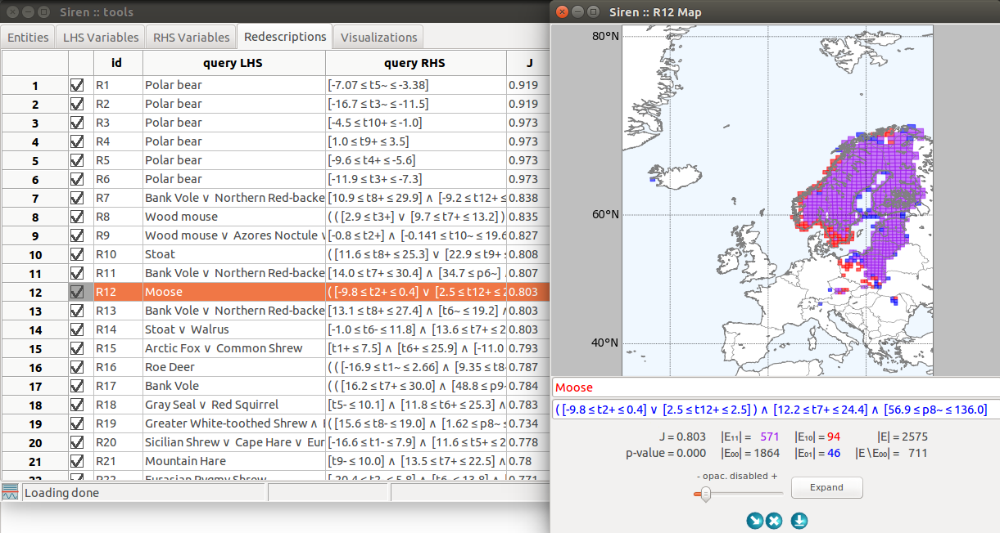

.. _download:

***************
Download
***************

.. note::
   *Siren* is a multi-platform software. It has been used on OS X and Ubuntu Linux.

   Siren and ReReMi are licensed under the Apache License, Version 2.0.

*Siren* and it's core mining algorithm *ReReMi* are implemented in Python.

The interface is built with the wxPython Open Source GUI toolkit, ensuring cross-platform compatibility.

The matplotlib library enables to generate high quality figures, seamlessly integrated in the interface.

The code is compatible with Python 3. Code from releases prior to ``5.0`` are compatible with Python 2.7.

.. _code:

Source code
============

Siren is available as a python package on `PyPI <https://pypi.org/project/python-siren/>`_.

The source code is hosted in a Git repository on `InriaForge <https://gforge.inria.fr/projects/siren/>`_.
You can `clone it <https://gforge.inria.fr/scm/?group_id=8278>`_.

*Siren* requires a number of python libraries: ``scipy``, ``numpy``, ``matplotlib``, ``wxPython``, ``mpl_toolkit.Basemap`` and ``sklearn`` (scikit-learn). Make sure they are installed and accessible before you run *Siren*.

You can find help under *Siren*'s Help menu or :project_url:`online <help/>`.

.. _linux:

For Linux
========== 

:deb_release:`.deb`

With a debian-based distribution run the following commands as root to install

.. code:: bash 

	  dpkg -i the_latest_siren_deb_package.deb

Afterward, you might need to run, to fix dependencies, i.e., install missing required packages

.. code:: bash 

	  apt-get -f install

Or use a tool like Ubuntu Software Center to open the package and install the application.

If everything went fine, you should find a Siren entry in your Applications menu.

You can find help under *Siren*'s Help menu or :project_url:`online </help/>`.

.. _mac:

For OS X
============== 

:mac_cap_release:`.dmg` (OS X 10.11, El Capitan)

:mac_release:`.dmg` (macOS 10.12, Sierra)

To *install*, download the above disk image and copy the file Siren to your Applications folder (or anywhere else outside the disk image). Once that is done you only have to double-click the program icon to run *Siren*.

To *run* the program, double-click the program icon.

You can find help under *Siren*'s Help menu or :project_url:`online </help/>`.

.. warning::
   **Note for users of OS X with Gatekeeper activated (10.7.5 and newer)**

   The Siren application is not digitally signed. Therefore, users with OS X Gatekeeper active cannot run the Siren application by double-clicking it. An attempt to do so will result in an error message. In order to open Siren for the first time, you need to right-click (command-click) the Siren icon, and select "Open" from the contextual menu. You only need to do this for the first launch after every re-installation of Siren.

   More information about Gatekeeper can be found at `<http://support.apple.com/kb/HT5290">`_.

.. _windows:

For Windows
============

:win_release:`.exe`

Download and run to install *Siren*.

.. image:: ../_figs/screenshots/Fullscreen_win.png

.. _changelog:

CHANGELOG
==========

.. literalinclude:: ../_static/CHANGELOG

The latest release for each platform are listed here. Previous versions can be found in :code_url:`this folder </>`.

Feel free to contact us for support or with feedback, bug reports and questions. :contact_email:`mailto:`
