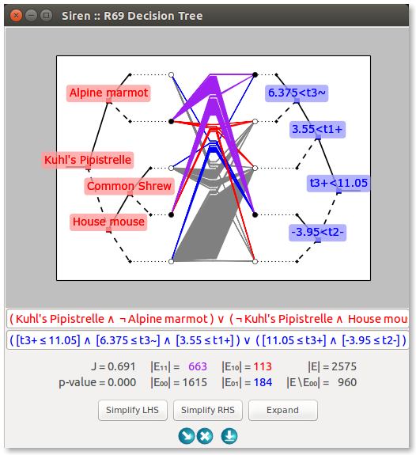
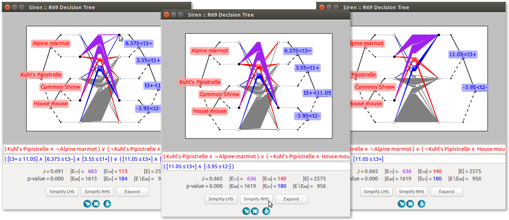
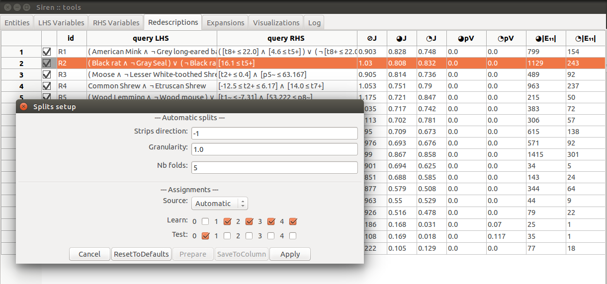

.. _funct:

***************
Features
***************

.. note::
   Using *Siren*, a user can explore data of his interest by interactively visualizing, editing and mining redescriptions.

   The main features of *Siren* can be categorized into mining, visualizing and editing.
		 

.. _func_viz:

Visualizing
======================================

*Siren* offers a number of different visualizations.

.. _viz_paco:

Parallel Coordinates
---------------------

A *parallel coordinates* plot represents the values taken by the entites for the variable appearing in the queries. It allows to easily visualize the impact of the queries conditions on the support of the redescription.

.. _viz_tree:

Trees diagram
---------------------

A *tree diagram* visualizes the queries as decision trees, linked through their leaves. It helps understand the structure of tree-based queries, which can otherwise appear rather complex.

.. _viz_proj:

2D Projections
---------------------

The *axis projection* and a number of data projections from the `scikit-learn package <http://scikit-learn.org/>`_ allow to highlight different aspects of the data.

* The *Axis Projection* plots the values of two selected variables.
* `Isomap Embedding <http://scikit-learn.org/0.13/modules/generated/sklearn.manifold.Isomap.html#sklearn.manifold.Isomap>`_
* `Locally Linear Embedding <http://scikit-learn.org/0.13/modules/generated/sklearn.manifold.LocallyLinearEmbedding.html#sklearn.manifold.LocallyLinearEmbedding>`_
* `Multidimensional Scaling Embedding <http://scikit-learn.org/0.13/modules/generated/sklearn.manifold.MDS.html#sklearn.manifold.MDS>`_
* `Randomized PCA Decomposition <http://scikit-learn.org/0.13/modules/generated/sklearn.decomposition.RandomizedPCA.html#sklearn.decomposition.RandomizedPCA>`_ (discrete Karhunen–Loève transform, KLT)
* `Sparse Random Projection <http://scikit-learn.org/0.13/modules/generated/sklearn.random_projection.SparseRandomProjection.html>`_
* `Spectral Embedding <http://scikit-learn.org/0.13/modules/generated/sklearn.manifold.SpectralEmbedding.html#sklearn.manifold.SpectralEmbedding>`_ (Johnson-Lindenstrauss transform)
* `Totally Random Trees Representation <http://scikit-learn.org/0.13/modules/generated/sklearn.ensemble.RandomTreesEmbedding.html#sklearn.ensemble.RandomTreesEmbedding>`_

.. _viz_map:

Maps (for geospatial data)
---------------------------

When the entities are geographic locations, we qualify the redescriptions as geospatial.
In that case, it is most natural to display the redescriptions projected on a map, to show the locations 
where both queries hold, only the left hand side query 
holds and only the right hand side query holds.

.. _viz_cv:

Coordinated views
---------------------------

Visualizations can be displayed either in their own windows separate from the main application window or in a dedicated grid of illustrations in the main application window. In addition, the main
window can be split horizontaly into two frames in order to examine at the same
time a list of redescriptions and several visualizations.

.. image:: ../_figs/screenshots/SplitFrameListViz.png

.. _func_edit:

Editing and Selecting
======================

Existing redescriptions can be edited and the visualization and statistics will be recomputed and changes reflected in the original redescription in the list and other visualizations of that same redescription.

It is also possible to build a new redescription from scratch.

Dragging the interval boxes in the parallel coordinates plot allows to edit the redescription interactively.

Similarly, clicking on the leaves in a tree diagram allows to add and remove branches to the queries. The resulting diagram can then be simplified automatically.

The user can select single entites from a view by clicking the corresponding dot/line in a view.

Furthermore, he can select a subset of entities by drawing a enclosing polygon directly on the view.

.. _func_mine:

Mining
======================================

At the core of *Siren* is the *ReReMi* redescription
mining algorithm. Various modes of interaction with the mining
algorithm are possible through the interface.

* Mine redescriptions from the data automatically.  
* Mine extensions of an existing redescription, on both sides or selectively on one side.
* It is possible to select a subset of variables for use in mining/expanding, by disabling some variables and to specify a subset of entities of interest to emphasize.

.. image:: ../_figs/stories/mine/mine.gif
	   :alt: Siren in action

.. _mine_post:

Postprocessing
---------------------------

It can be useful to filter redundant redescriptions, that is, redescriptions that cover approximately the same entities even
if they have (somewhat) different sets of variables.

This can be done automatically, by either selecting a redescription
and asking *Siren* to filter out all redescriptions that are redundant with respect
to the selected one, or by letting it go through the whole list of redescriptions filtering out all
redescriptions that are redundant with respect to some earlier-encountered (i.e. better)
redescription.

.. _mine_kfold:

k-fold testing
---------------------------

To help study how well the redescriptions mined using a particular set
of parameters generalize to unseen entities, *Siren* allows to easily partition the data, run the algorithm on a selected
subset of the data and compare accuracy and support of the results. 

