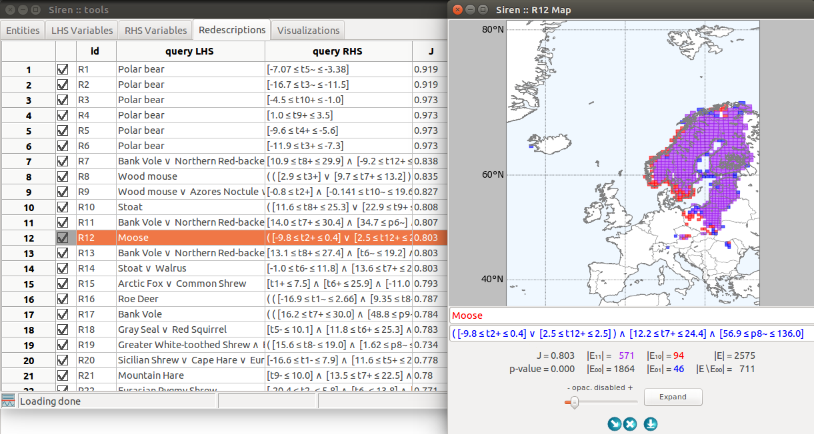

.. _intro:

***************
Introduction
***************

.. note::
   *Siren* is a tool for interactive mining and visualization of redescriptions.
   
   Redescription mining is a powerful data analysis tool that aims at finding alternative descriptions of the same entities.
 
   For example, in biology, an important task is to identify the bioclimatic constraints that allow some species to survive, that is, to describe geographical regions in terms of both their bioclimatic conditions and the fauna that inhabit them.

