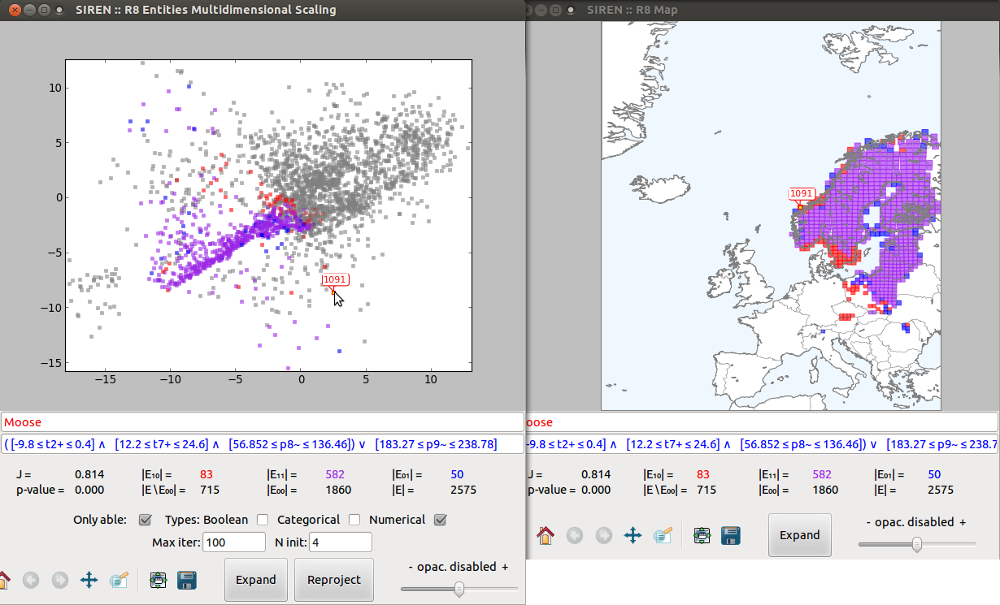
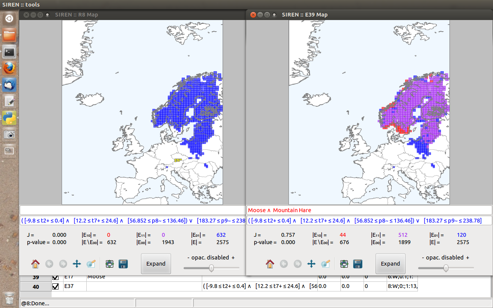
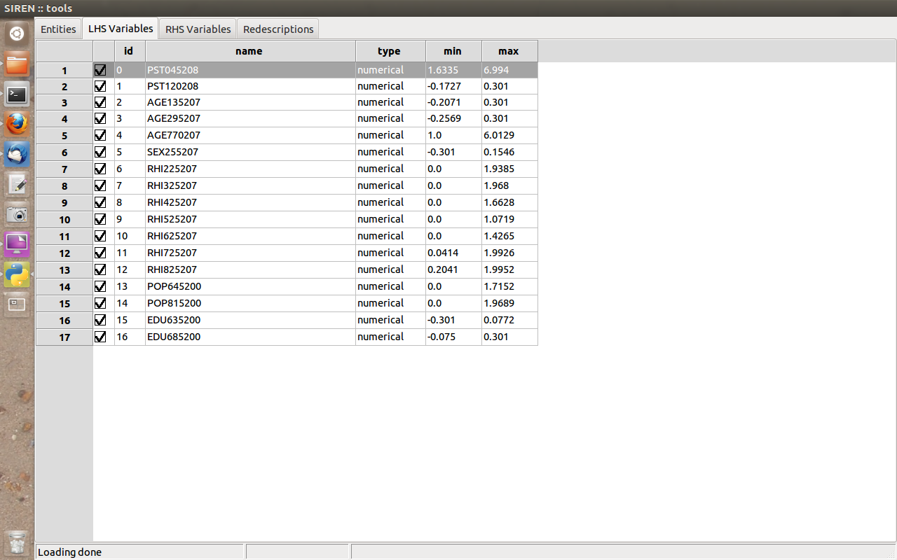
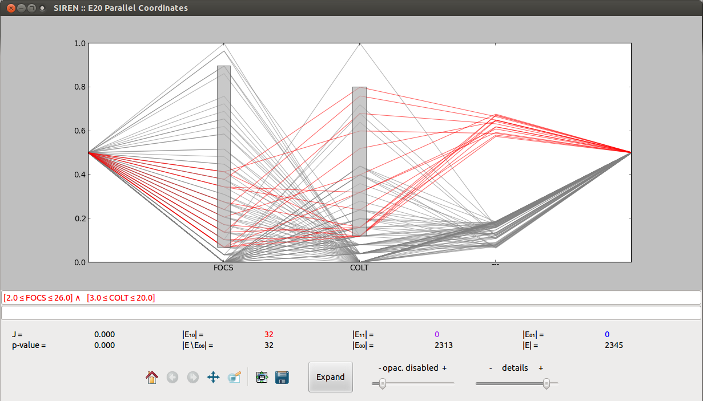

.. _usecase:

******************
Sample Use-Cases
******************

.. _uc_bio:

Biological niche-finding
=========================

.. note:: 
   The first use-case concern niche-finding, i.e. the problem of finding species' bioclimatic envelope, an important task in biology.

   The :ref:`video tutorial <vtutorial>` provides a step by step use-case with this data.

Data
------

The Bio data describes spatial areas of Europe, 2575 squares of side roughly 50 kilometers. The left hand side data contains information 
about the mammals that live in these areas denoted with the names of the respective species. The minimum, maximum and average monthly temperatures in degrees Celsius as well as average monthly precipitation in millimeters, make up the right hand side data, denoted as :sup:`+`\ :sub:`x`\ , t\ :sup:`-`\ :sub:`x`\ , t\ :sup:`=`\ :sub:`x`\ and p\ :sup:`=`\ :sub:`x`\ , respectively, where x is the number of the month.
The data comes from two publicly available datasets: European Mammals atlas and Worldclim climate data.

Exploration
---------------

1. The first tab contains a list of entities. Expanding columns of interest reveals the actual values of the variables.

.. image:: ../_static/stories/BIO/windows/Bio_EntitiesClosed.png
	   :class: sideL
.. image:: ../_static/stories/BIO/windows/Bio_EntitiesOpen.png
	   :class: sideR

2. Next comes the list of left-hand side variables and right-hand side variables.

.. image:: ../_static/stories/BIO/windows/Bio_VariablesLHS.png
	   :class: sideL

3. Let's consider the Moose, plot this variable in a map to create a new redescription.

4. Then, we can let the algorithm find best expansions.

5. After a few seconds, we get a number of expansions and can sort them by accuracy or let the algorithm process them to select the top non-redundant ones, here we obtain one.

.. image:: ../_static/stories/BIO/interact/Bio_ExpansionsSortedRMoose.png
	   :class: sideL

6. Let's have a look at this redescription about the Moose, simultaneously plotting it in a Multidimensional Scaling projection and on a map.

.. image:: ../_static/stories/BIO/windows/Bio_MDSViewRMoose.png
	   :class: sideL

7. We can select a dot to highlight the entities. The views are linked together so the entity will be highlighted across all views for that specific redescription.

8. To select a set of points lying in some area, we can draw an enclosing polygon. Similarly, when we click :menuselection:`Edit --> (De)select polygon` (or press the corresponding key) to select the dots inside the polygon, they will be highlighted across the different views.

.. image:: ../_static/stories/BIO/interact/Bio_SelectPolySideRMoose.png

9. With this selected entities we can recompute the left-hand side query while adding weight on this area, to try removing it from E\ :sub:`10`. To do this, we clear the left-hand side query, press ``ENTER`` to update the redescription then choose :menuselection:`Process --> Overfit LHS`.

10. And we automatically obtain a new left-hand side query involving Mountain Hare, removing this region from the support.

.. uc_us:

US census and election funds
=============================

.. note:: 
   We now present a short sample use-case with US census and election data.

Data
-----

The US data describes the counties of continental United-States. The left hand side data contains socio-economic statistical indicators about these areas, see details `here <http://www.fedstats.gov/qf/download/DataDict.txt>`_.

The right hand side consists of data about funding of the electoral campaigns in 2006, 2008 and 2010, the total funds, percentage allotted 
to republican and to democratic party, respectively.

The data has been gathered from two public websites: `FedStats <http://www.fedstats.gov/>`_ and `Open Secrets <http://www.opensecrets.org/elections/>`_.
Logarithmic transformation was applied to variables having a log-normal distribution to obtain a better dispersion.

Exploration
------------

1. Again, the first tab contains a list of entities...

.. image:: ../_static/stories/US/windows/US_Entities.png

2. ... and the following two the list of left-hand side variables and right-hand side variables, respectively.

.. image:: ../_static/stories/US/windows/US_VariablesRHS.png
	   :class: sideR

3. Here, the *Redescriptions* tab contains redescriptions mined previously and loaded from a file.

4. Now, we will recompute these redescription over a subset of the entities, say, excluding the east side of the US. To do so we plot a redescription with a variable set to its full range to see all entities on the map and draw a polygon enclosing the area we wish to exclude.

.. image:: ../_static/stories/US/interact/US_PolyDisable0.png

5. Next we click :menuselection:`Edit --> (De)select polygon` (or press the corresponding key) to select the entities inside the polygon.

.. image:: ../_static/stories/US/interact/US_PolyDisable1.png

6. Then clicking :menuselection:`Edit --> (Dis)able selected` (or press the corresponding key) to disable the entities. This automatically recomputes all redescriptions restricted to the remaining entities (observe the updated statistics in the list and the map). 

.. image:: ../_static/stories/US/interact/US_PolyDisable2.png

.. _uc_dblp:

DBLP Computer Science Bibliography
===================================

.. note::
   In this third example we consider non-geospatial data, namely from the DBLP Computer Science Bibliography.

Data
-----

This dataset comes from the `DBLP data base <http://www.informatik.uni-trier.de/~ley/db/>`_ of computer science bibliography.
Here the entities are researchers, the left-hand side data indicates major CS conferences in which they have published while the right-hand side data contains co-authorship information.

Unlike in the previous examples, the entities in this data are not associated to goegraphic coordinates, hence this data is not geospatial and the redescriptions cannot be plotted on maps. However, the other visualizations can be used for exploration.

Exploration
------------

1. Once more, we can consult the list of entities in the first tab.

2. Similarly, left-hand side variables and right-hand side variables are listed in the next two tabs.

3. Redescriptions are listed in the fourth tab.

4. We can visualize the second redescription as a parallel coordinates plot. Using a slider, we can adjust the level of details, i.e. the amount of entities drawn.

.. image:: ../_static/stories/DBLP/interact/DBLPPick_PacoViewRICDMdetails.gif

5. We can also visualize it under a couple of projections.

.. image:: ../_static/stories/DBLP/interact/DBLPPick_ViewsSideRICDM.png

6. These various views are linked so that when we select a dot or a subset of dots the will be highlighted across the views.

.. image:: ../_static/stories/DBLP/interact/DBLPPick_SelectDotSideRICDM.png
	    :class: sideL
.. image:: ../_static/stories/DBLP/interact/DBLPPick_SelectPolySideRICDM.png
	    :class: sideR

7. We can edit the redescription directly in the parallel coordinate, modifying the bounds of the literal by dragging the bottom and top sides of the gray interval boxes.

8. Let's now build another redescription by selecting a pair of conferences and setting their intervals to generate a new left-hand side query.

9. Now we let the algorithm find matching queries for the right-hand side and obtain, for instance, the following redescription.

.. _uc_finnelec:

Finnish 2011 parliamentary elections
=========================================

.. note:: 
   In this use case we consider the case of exploring open data about the candidates to a national election using redescription mining. 

Data
-----

The data was collected from `www.vaalikone.fi <http://www.vaalikone.fi>`_, the *election engine* of the Finnish newspaper Helsingin Sanomat
and `made publicly available <http://blogit.hs.fi/hsnext/hsn-vaalikone-on-nyt-avointa-tietoa>`_. One view contains candidate personal profile attributes, such as party, age, and education, while the answers provided to 30 multiple-choice questions and assigned importance form
the other view.

*Under translation...*
